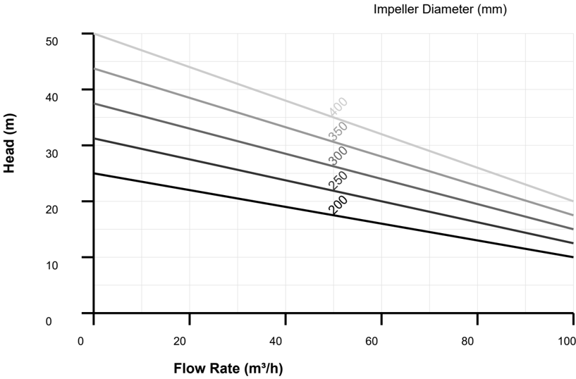
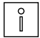
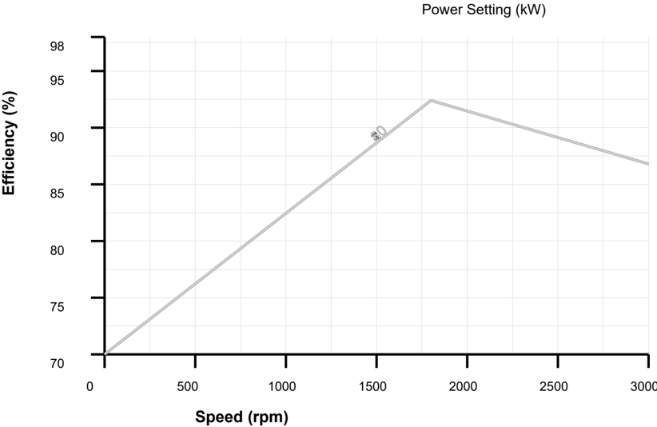
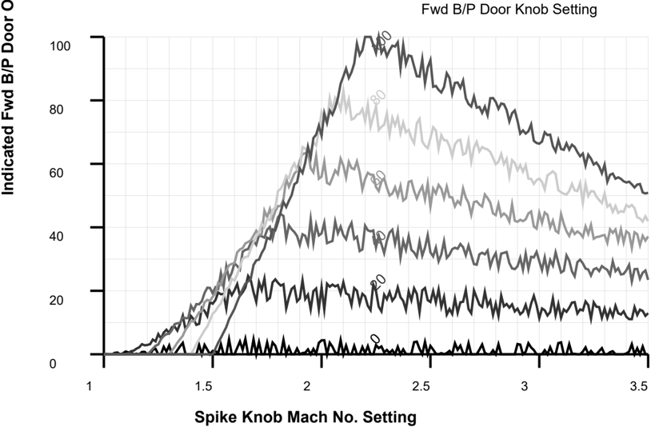
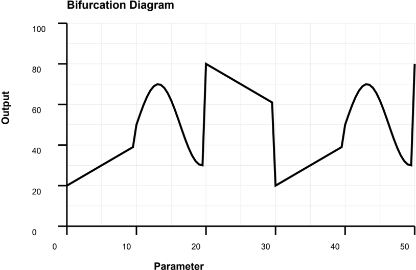
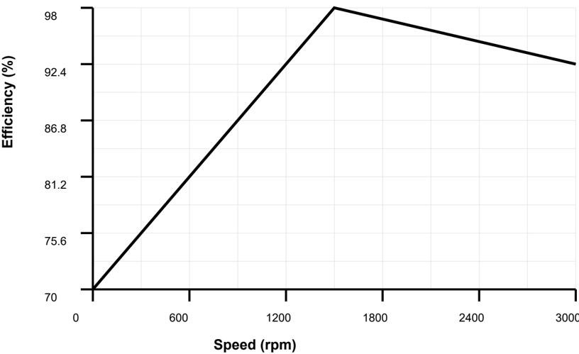
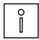
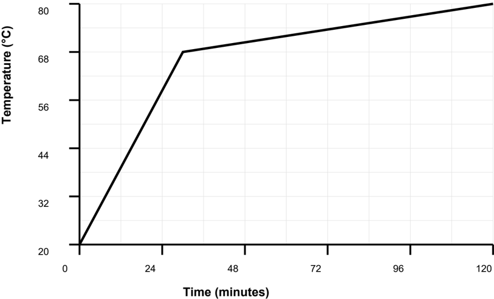
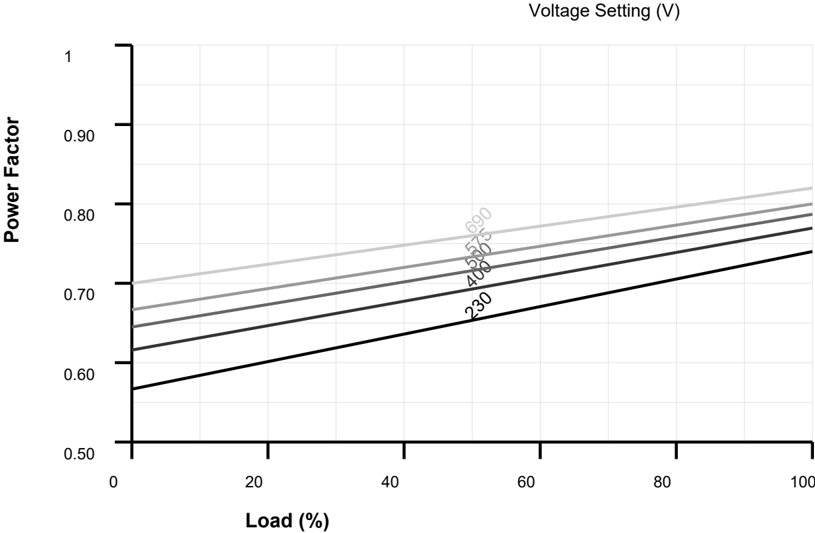
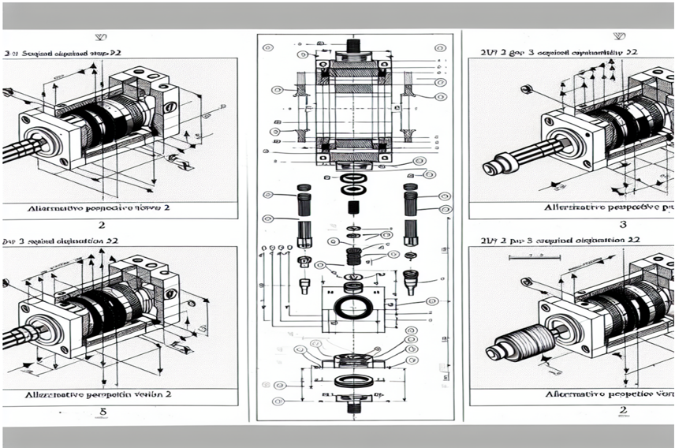

## Hydraulic System Hydraulic Valve

## Model: FX-2652C

## OPERATION AND MAINTENANCE MANUAL

Date: November 2025

## TABLE OF CONTENTS

| Section                  |   Page |
|--------------------------|--------|
| Table Of Contents        |      2 |
| Introduction             |      5 |
| Safety Instructions      |      6 |
| Technical Specifications |      7 |
| Installation             |     10 |
| Operation                |     13 |
| Maintenance              |     16 |
| Troubleshooting          |     19 |
| Parts List               |     20 |
| Wiring Diagrams          |     23 |
| Standards                |     25 |
| Appendix                 |     27 |

All personnel involved in installation, operation, or maintenance of this equipment must be properly trained and familiar with the contents of this manual.

This manual is organized into sections covering safety, technical specifications, installation, operation, maintenance, troubleshooting, and parts information. Each section should be reviewed before beginning work.

Safety is the highest priority when working with industrial equipment. Always follow safety instructions and use appropriate personal protective equipment.

For technical support or additional information, please contact your local distributor or visit our website

The information in this manual is based on the latest technical data available at the time of publication. Specifications and procedures may be updated periodically to reflect improvements and changes.

This manual provides comprehensive information for the operation, maintenance, and troubleshooting of the Hydraulic System model FX-2652C.

The Hydraulic System is designed for industrial applications requiring reliable performance and long service life. Proper installation, operation, and maintenance are essential for achieving optimal results.

| Warning   | Description                                                                                                | Elimination/Action                                                                                              |
|-----------|------------------------------------------------------------------------------------------------------------|-----------------------------------------------------------------------------------------------------------------|
|           | Allow equipment to cool before maintenance. Use appropriate protective equipment when handling components. | hot Wait for equipment to reach ambient temperature. Wear heat-resistant gloves.                                |
|           | Some lubricants and materials may cause allergic reactions in sensitive individuals.                       | Use protective gloves. Ensure adequate Consult material safety data sheets.                                     |
|           | Pressure can build up during operation. Sudden release can cause injury.                                   | Release pressure slowly using appropriate procedures. Never remove caps or plugs under pressure.                |
|           | Overfilling can cause leakage, overheating, and equipment damage.                                          | Follow manufacturer specifications for fill Check levels regularly.                                             |
|           | Mixing incompatible oils can cause equipment failure and void warranty.                                    | Use only specified lubricants. Drain completely before changing oil type.                                       |
|           | Warming oil before use improves flow and ensures proper distribution.                                      | Heat oil to recommended temperature (typically 40-50°C) before application.                                     |
|           | The amount of new lubricant should match the volume drained to maintain proper levels.                     | Measure drained volume accurately. Add equivalent amount of new lubricant.                                      |
|           | Residual oil can be slippery and cause falls. properly.                                                    | Dispose of Clean up spills immediately. Use appropriate absorbent materials. Follow local disposal regulations. |

All specifications are subject to change without notice as improvements are made to the product. Always refer to the latest version of this manual for current specifications.

Some specifications may be optional or configurable. Consult with technical support or your local distributor to determine available options for your specific requirements.

Environmental conditions such as temperature, altitude, and humidity can affect equipment performance. Specifications are based on standard conditions unless otherwise specified.

This section provides detailed technical specifications for the Hydraulic System model FX-2652C. All specifications are based on standard operating conditions unless otherwise noted.

## General Specifications

| Parameter             | Value     | Unit   | Notes          |
|-----------------------|-----------|--------|----------------|
| Pressure Range        | 420       | bar    | Optional       |
| Flow Rate             | 25        | m³/h   |                |
| Power Range           | 15        | kW     |                |
| Operating Temperature | 0°C       |        | As specified   |
| Weight                | 85        | kg     | Approximate    |
| Operating Temperature | -19 to 60 | °C     | Continuous     |
| Storage Temperature   | -23 to 61 | °C     |                |
| Humidity              | 12 to 88  | % RH   | Non-condensing |
| Protection Class      | IP65      |        | IEC 60529      |
| Noise Level           | 59        | dB(A)  | At 1m distance |
| Vibration             | £ 3       | mm/s   | RMS            |
| Service Factor        | 1.15      |        |                |

## Dimensions

| Dimension      | Value   | Unit   | Tolerance   |
|----------------|---------|--------|-------------|
| Length         | 877     | mm     | ±2 mm       |
| Width          | 532     | mm     | ±2 mm       |
| Height         | 275     | mm     | ±2 mm       |
| Mounting Holes | M8      |        |             |
| Shaft Diameter | 42      | mm     | ±0.1 mm     |
| Base Height    | 198     | mm     | ±1 mm       |

## Performance Data

| Operating Condition   |   Minimum |   Nominal |   Maximum | Unit   |
|-----------------------|-----------|-----------|-----------|--------|
| Power Consumption     |        80 |        95 |       110 | %      |
| Efficiency            |        88 |        95 |        99 | %      |
| Load Factor           |        23 |        77 |       102 | %      |

| Operating Condition   |   Minimum |   Nominal |   Maximum | Unit   |
|-----------------------|-----------|-----------|-----------|--------|
| Speed                 |       720 |      1483 |      2960 | rpm    |
| Torque                |        33 |        79 |       160 | Nm     |

## Environmental Conditions

| Condition         | Operating Range   | Storage Range   | Unit   |
|-------------------|-------------------|-----------------|--------|
| Temperature       | -18 to 40         | -26 to 69       | °C     |
| Relative Humidity | 16 to 85          | 7 to 91         | %      |
| Altitude          | 0 to 1397         | 0 to 2585       | m      |
| Vibration         | £ 2               | £ 10            | mm/s   |

## Electrical Specifications

| Parameter      | Value   | Unit   | Standard   |
|----------------|---------|--------|------------|
| Supply Voltage | 400V    | V AC   | IEC 60038  |
| Frequency      | 50 Hz   | Hz     | IEC 60034  |
| Current Rating | 80      | A      |            |
| Power Factor   | 0.95    |        |            |

| Parameter        | Value   | Value   | Unit   | Standard   |
|------------------|---------|---------|--------|------------|
| Starting Current | 433     | % of    | rated  |            |
| Insulation Class | H       |         |        | IEC 60085  |
| Protection       | IP54    |         |        | IEC 60529  |

Regular inspection of electrical connections and components is essential for safe and reliable operation. Include electrical inspection in your maintenance schedule.

Protection class ratings indicate the degree of protection against ingress of solid objects and water. Ensure that the protection class is appropriate for your installation environment.

## 4.1 Installation Requirements

## Installation Procedures

| Action                                                                                                                                                                                                                                                                                                        | Note                                                                                                             |
|---------------------------------------------------------------------------------------------------------------------------------------------------------------------------------------------------------------------------------------------------------------------------------------------------------------|------------------------------------------------------------------------------------------------------------------|
| • Lubricate the sealing with grease just before fitting. • (Not too early - there is a risk of dirt and particles adhering to the sealing.) • Fill 1/2 of the space between the dust lip and main lip with grease. • If the sealing is without dust lip, just lubricate main lip with a thin layer of grease. | foreign the the Ensure that no grease is applied to the marked surface. Use approved lubricants specified in the |
| • Check the sealing to ensure that: • The sealing is of the correct type. • There is no damage on the main lip.                                                                                                                                                                                               | Article number is specified in Equipment on page                                                                 |
| • Inspect the shaft surface before mounting. • If scratches or damage are found, the shaft must be replaced since it may result in future leakage. • Do not try to grind or polish the shaft surface to of the defect.                                                                                        | get rid Ensure proper surface finish is maintained. Refer to specifications for surface roughness                |
| • Apply proper torque to all fasteners. • Use torque values specified in the technical sheet (23 Nm for main bolts). • Tighten in the correct sequence as shown in installation diagram.                                                                                                                      | data the Overtightening can damage components. Undertightening can loosening during operation.                   |

Some installation tasks may require specialized tools or equipment. Ensure all necessary tools are available before beginning.

Auxiliary systems such as cooling, lubrication, and ventilation must be properly connected and verified before startup.

After installation, perform all required alignment, calibration, and verification procedures before placing th equipment into service.

Coordinate with other trades and systems to ensure proper integration of the equipment into the overall facility.

The Hydraulic System requires careful handling during transport and installation to prevent damage to critical components.

Before installation, ensure the following requirements are met:

## Installation Checklist

| Requirement                                                  | Specification              | Status   |
|--------------------------------------------------------------|----------------------------|----------|
| Adequate space for installation and maintenance access       | As per installation manual | n        |
| Proper foundation or mounting surface                        | As per installation manual | n        |
| Correct electrical supply voltage and frequency              | As per installation manual | n        |
| Appropriate environmental conditions (temperature, humidity) | As per installation manual | n        |
| Compliance with local building and electrical codes          | As per installation manual | n        |

## Foundation Requirements

| Parameter            | Minimum           | Recommended       | Unit   |
|----------------------|-------------------|-------------------|--------|
| Foundation Thickness | 312               | 351               | mm     |
| Concrete Strength    | C21               | C29               |        |
| Reinforcement        | As per local code | As per local code |        |
| Anchor Bolt Size     | M12               | M16               |        |
| Anchor Bolt Depth    | 190               | 273               | mm     |

## 4.2 Installation Steps

## Installation Procedure

|   Step | Description                                                         | Duration   | Tools Required                        |
|--------|---------------------------------------------------------------------|------------|---------------------------------------|
|      1 | Unpack the equipment and inspect for damage.                        | 15 min     | Multimeter                            |
|      2 | Position the equipment according to layout drawings.                | 15 min     | Alignment tools, Multimeter           |
|      3 | Secure the equipment to the foundation using appropriate fasteners. | 30 min     | Multimeter, Wrench set, Torque wrench |
|      4 | Connect electrical wiring according to wiring diagrams.             | 30 min     | Level                                 |

|   Step | Description                                              | Duration   | Tools Required                 |
|--------|----------------------------------------------------------|------------|--------------------------------|
|      5 | Connect auxiliary systems (cooling, lubrication, etc.).  | 30 min     | Alignment tools                |
|      6 | Perform initial alignment and calibration.               | 30 min     | Alignment tools                |
|      7 | Verify all connections and safety systems.               | 30 min     | Alignment tools, Level, wrench |
|      8 | Perform initial test run according to startup procedure. | 1 hour     | Level, Multimeter              |

## Torque Specifications

| Component            | Bolt Size   |   Torque | Unit   |
|----------------------|-------------|----------|--------|
| Mounting Bolts       | M12         |       83 | Nm     |
| Shaft Coupling       | M8          |       38 | Nm     |
| Terminal Connections | M6          |        8 | Nm     |
| Cover Bolts          | M8          |       18 | Nm     |

During installation, periodically verify that all connections are secure and that no damage has occurred to components. Address any issues before proceeding.

If installation issues arise, stop work and consult with technical support before proceeding. Do not force components or make unauthorized modifications.

Follow the installation steps in the order specified. Skipping steps or performing them out of sequence may result in improper installation or equipment damage.

## Note

After installation, allow sufficient time for the equipment to stabilize before performing calibration or alignment procedures.

For more information see:

- *Installation Guide - Electrical Connections*

## 5.1 Operating Procedures

Some operating modes may have specific requirements or limitations. Review operating mode specifications before changing modes.

Monitor operating parameters regularly to ensure the equipment is operating within specified limits. Abnormal readings may indicate problems requiring attention.

Operators must be trained and familiar with the equipment operation, control functions, and emergency procedures. Never operate equipment without proper training.

If operating conditions change significantly, review operating parameters and adjust as necessary. Sudden changes may indicate problems requiring attention.

Follow the startup sequence exactly as specified. Improper startup procedures may cause equipment damage or safety hazards.

Follow these procedures for safe and efficient operation:

## Operating Parameters

| Parameter        | Setting    | Range                   | Unit   |
|------------------|------------|-------------------------|--------|
| Startup Sequence | Automatic  | Manual/Automatic        |        |
| Operating Mode   | Continuous | Continuous/Intermittent |        |
| Control Method   | Manual     | Manual/Automatic/Remote |        |
| Monitoring       | Enabled    | Enabled/Disabled        |        |
| Speed Setpoint   | 1449       | 2194                    | rpm    |
| Load Limit       | 93         | 38                      | %      |

## Startup Sequence

|   Step | Action                | Duration   | Status Indicator   |
|--------|-----------------------|------------|--------------------|
|      1 | Power On              | Immediate  | Power LED          |
|      2 | System Initialization | 15         | Init LED           |
|      3 | Self-Test             | 20         | Test LED           |
|      4 | Ready State           | Continuous | Ready LED          |
|      5 | Start Command         | On Demand  | Run LED            |

## 5.2 Control Functions

## Control Functions

| Control        | Function                                       | Location   | Type            |
|----------------|------------------------------------------------|------------|-----------------|
| Start/Stop     | Controls equipment operation                   | Panel A    | Push Button     |
| Speed Control  | Adjusts operating speed within specified range | Panel B    | Selector Switch |
| Emergency Stop | Immediately stops all operations               | Panel C    | Emergency Stop  |
| Reset          | Clears fault conditions and resets system      | Panel D    | Reset Button    |
| Mode Selection | Selects operating mode                         | Panel E    | Selector        |

## Status Indicators

| Indicator   | Color   | Meaning           | Action           |
|-------------|---------|-------------------|------------------|
| Power       | Green   | System powered    | Normal operation |
| Run         | Green   | Equipment running | Normal operation |
| Fault       | Red     | Fault detected    | Check fault code |
| Warning     | Yellow  | Warning condition | Review warning   |
| Maintenance | Yellow  | Maintenance due   | Schedule service |

## Operating Characteristics

Emergency stop functions must be tested regularly to ensure they are functioning properly. Never disable safety systems.

When operating in automatic mode, verify that all control signals are functioning correctly and that the equipment responds appropriately to commands.

Keep operating logs documenting operating hours, parameters, and any issues encountered. This information is essential for maintenance planning and troubleshooting.

## 6.1 Maintenance Schedule

Before performing any maintenance, ensure the equipment is safely shut down and all safety protocols are followed. Refer to Section 2 for safety instructions.

Keep detailed maintenance records including dates, tasks performed, parts replaced, and lubricants used. This information is required for warranty claims and service history.

All maintenance work must be performed by qualified personnel familiar with the equipment and maintenance procedures. Improper maintenance may cause equipment damage or safety hazards.

Use only approved replacement parts and lubricants specified in this manual. Using incorrect parts or lubricants may cause equipment failure and void warranty.

## Maintenance Schedule

| Maintenance Task   | Frequency        | Duration   | Personnel    |
|--------------------|------------------|------------|--------------|
| Visual Inspection  | Daily            | 5 min      | Operator     |
| Lubrication        | Every 208 hours  | 30 min     | Technician   |
| Filter Replacement | Every 840 hours  | 1 hour     | Technician   |
| Bearing Inspection | Every 1239 hours | 2 hours    | Engineer     |
| Complete Overhaul  | Every 7587 hours | 8 hours    | Service Team |
| Calibration Check  | Every 2724 hours | 1 hour     | Engineer     |

## Inspection Checklist

| Item       | Check              | Acceptance Criteria        | Frequency   |
|------------|--------------------|----------------------------|-------------|
| Bearings   | Visual/Temperature | No noise, temp < 70°C      | Weekly      |
| Seals      | Visual             | No leakage                 | Weekly      |
| Mounting   | Visual/Torque      | Bolts tight, no movement   | Monthly     |
| Electrical | Visual/Measurement | No damage, correct voltage | Monthly     |
| Cooling    | Visual/Temperature | Clean, adequate flow       | Weekly      |
| Vibration  | Measurement        | < 5 mm/s RMS               | Monthly     |

## 6.2 Maintenance Procedures

## Component Maintenance Intervals

| Component   | Inspection Interval   | Replacement Interval   | Condition          |
|-------------|-----------------------|------------------------|--------------------|
| Bearings    | Every 1287 hours      | Every 11964 hours      | Based on condition |
| Seals       | Every 733 hours       | Every 3176 hours       | If leaking         |
| Filters     | Every 821 hours       | Every 1199 hours       | If                 |
| Belts       | Every 1415 hours      | Every 3272 hours       | If worn            |

After completing maintenance, verify that all components are properly installed and that the equipment is ready for operation before restarting.

Some maintenance tasks require specialized tools or training. Do not attempt maintenance beyond your qualification level. Contact qualified service personnel when needed.

## Efficiency vs Speed

- Always shut down and lock out equipment before maintenance.
- Follow manufacturer's recommendations for lubricants and spare parts.
- Inspect all components for wear, damage, or contamination.
- Replace worn or damaged parts immediately.
- Keep maintenance records for warranty and service history.
- Use only approved replacement parts and materials.

## Note

Inspect components regularly for signs of wear or damage. Early detection of problems can prevent more serious failures and reduce downtime.

For more information see:

- *Maintenance Guide - Lubrication Specifications*

## Temperature Characteristics

## Temperature Rise vs Time

Keep detailed records of any troubleshooting procedures performed, including symptoms observed, measurements taken, and actions attempted. This information is valuable for warranty claims and future service.

Troubleshooting the Hydraulic System requires systematic diagnosis of symptoms and their underlying causes. This section provides guidance for identifying and resolving common operational issues.

Many issues can be resolved through basic inspection and maintenance. However, some problems may indicate more serious conditions that require professional service. When in doubt, contact technical support.

## Common Issues and Solutions

| Symptom                                 | Possible Cause                                                  | Solution                                                                                  |
|-----------------------------------------|-----------------------------------------------------------------|-------------------------------------------------------------------------------------------|
| Ground fault detected                   | Insulation failure, moisture ingress, damaged wiring            | or Measure insulation resistance, wiring for damage, check for                            |
| Erratic operation or speed fluctuations | Control system issue or sensor malfunction                      | Check control system connections, verify sensor readings                                  |
| Fault Code H426: Low pressure           | Pump failure, leak in system, or valve issue                    | relief Check pump, inspect for leaks, test valve                                          |
| Premature component failure             | Incorrect operation, poor maintenance, or environmental factors | Review operating procedures, improve maintenance schedule, check environmental conditions |
| Equipment will not start                | Power supply issue or circuit breaker tripped                   | Check electrical connections, voltage, reset circuit necessary                            |
| Fault Code H971: Pump cavitation        | Insufficient inlet pressure, blocked or air ingress             | filter, Check inlet pressure, inspect remove air                                          |
| Seal leakage detected                   | Seal wear, improper installation, excessive pressure            | or Inspect seals for wear, verify check pressure                                          |
| Alarm A70: Fluid level low              | Leak in system or consumption                                   | Check for leaks, add fluid if                                                             |
| Phase loss or imbalance                 | Loose connection, damaged cable, or supply issue                | Check all phase connections, measure phase voltages, inspect                              |
| Reduced efficiency over time            | Normal wear, contamination buildup, or calibration drift        | Perform maintenance, clean components, recalibrate systems                                |
| Unexpected shutdown during operation    | Protection activation, power loss, system fault                 | or Check protection settings, verify supply, review fault                                 |
| Reduced performance or efficiency       | Worn components, contamination, or incorrect settings           | Inspect and clean components, operating parameters                                        |

When troubleshooting, always start with the simplest possible causes before investigating more complex issues. Many problems can be resolved through basic inspection and cleaning.

Use systematic diagnostic procedures: observe symptoms, identify possible causes, test hypotheses, and verify solutions. Document each step for future reference.

Note

Before replacing components, verify that the root cause has been identified. Replacing parts without addressing the underlying issue may lead to repeated failures.

For more information see:

*Technical Support - Contact Information*

## Spare Parts List

| Part Number   | Description      |   Quantity | Material        | Supplier Part No.   |
|---------------|------------------|------------|-----------------|---------------------|
| FX-2652C-321  | Main Housing     |          3 | Stainless Steel | SP-61488            |
| FX-2652C-568  | Rotor Assembly   |          3 | Cast Iron       | SP-83367            |
| FX-2652C-187  | Stator Assembly  |          2 | Stainless Steel | SP-64894            |
| FX-2652C-126  | Bearing Set      |          4 | Cast Iron       | SP-59196            |
| FX-2652C-654  | Shaft            |          4 | Plastic         | SP-62308            |
| FX-2652C-738  | Seal Kit         |          2 | Plastic         | SP-64688            |
| FX-2652C-653  | Gasket Set       |          4 | Cast Iron       | SP-60268            |
| FX-2652C-941  | Mounting Bracket |          2 | Steel           | SP-47560            |
| FX-2652C-432  | Cooling Fan      |          2 | Plastic         | SP-65220            |
| FX-2652C-620  | Terminal Box     |          3 | Plastic         | SP-60761            |

| Part Number   | Description        |   Quantity | Material        | Supplier Part No.   |
|---------------|--------------------|------------|-----------------|---------------------|
| FX-2652C-551  | Nameplate          |          2 | Cast Iron       | SP-35100            |
| FX-2652C-182  | Fastener Kit       |          4 | Plastic         | SP-94781            |
| FX-2652C-943  | Thermal Protection |          2 | Bronze          | SP-48341            |
| FX-2652C-961  | Vibration Sensor   |          2 | Stainless Steel | SP-57990            |
| FX-2652C-827  | Oil Filter         |          2 | Stainless Steel | SP-12662            |
| FX-2652C-585  | Cooling Coil       |          1 | Bronze          | SP-54530            |
| FX-2652C-129  | Impeller           |          2 | Stainless Steel | SP-74991            |

## Recommended Spare Parts

| Part Number   | Description      | Recommended Stock   | Lead Time   |
|---------------|------------------|---------------------|-------------|
| FX-2652C-330  | Bearing Set      | 1-2                 | 2-4 weeks   |
| FX-2652C-377  | Seal Kit         | 1-2                 | 4-6 weeks   |
| FX-2652C-418  | Gasket Set       | 3-5                 | 1-2 weeks   |
| FX-2652C-645  | Filter Element   | 2-3                 | 1-2 weeks   |
| FX-2652C-528  | Thermal Fuse     | 2-3                 | 2-4 weeks   |
| FX-2652C-441  | Vibration Sensor | 1-2                 | 2-4 weeks   |
| FX-2652C-666  | Cooling Fan      | 1-2                 | 4-6 weeks   |

## Lubrication Requirements

| Component     | Lubricant Type   |   Quantity | Interval         |
|---------------|------------------|------------|------------------|
| Main Bearings | Oil ISO VG 68    |        154 | Every 1014 hours |
| Gearbox       | Oil ISO VG 220   |          4 | Every 3098 hours |
| Seals         | Silicone Grease  |         22 | Every 536 hours  |

Refer to the wiring diagrams provided in the appendix. All connections must be made according to local electrical codes and regulations.

## Terminal Connections

| Terminal   | Function         | Wire Size   | Voltage   |
|------------|------------------|-------------|-----------|
| L1, L2, L3 | Power Input      | 4 mm²       | 230V      |
| PE         | Protective Earth | 2.5 mm²     | 0V        |
| U, V, W    | Motor Output     | 6 mm²       | Variable  |

| Terminal   | Function       | Wire Size   | Voltage   |
|------------|----------------|-------------|-----------|
| 24V        | Control Supply | 0.75 mm²    | 24V DC    |
| GND        | Control Ground | 0.75 mm²    | 0V        |

The Hydraulic System is compliant with applicable international standards for industrial machinery and electrical equipment. In case of deviation from these standards, these are listed in the declaration of incorporation. The declaration of incorporation is part of the delivery.

## Machine Standards

| Standard    | Description                                                                   |
|-------------|-------------------------------------------------------------------------------|
| ISO 12100   | Safety of machinery - General principles for design - Risk risk reduction     |
| IEC 60204-1 | Safety of machinery - Electrical equipment of machines - Part 1: requirements |

Other Standards Used in Design

| Standard         | Description                                                                              |
|------------------|------------------------------------------------------------------------------------------|
| IEC 61000-6-2    | Electromagnetic compatibility (EMC) - Part 6-2: Generic Immunity standard for industrial |
| IEC 61000-6-4    | Electromagnetic compatibility (EMC) - Part 6-4: Generic Emission standard for industrial |
| ISO 13849-1:2015 | Safety of machinery - Safety related parts of control systems General principles for     |

## A. Technical Data Sheets

Additional technical data sheets and detailed specifications are available upon request.

## Revision History

## Revision History

| Revision   | Description                                                                                                                                                                                                                            |
|------------|----------------------------------------------------------------------------------------------------------------------------------------------------------------------------------------------------------------------------------------|
| Y          | • Published in release R23A. The following updates are made in this • Updated information about special treated • Removed information about position switches as they are no longer • Updated torque specifications for various        |
| U          | • Published in release R24A. The following updates are made in this • Updated information about special treated • Removed information about position switches as they are no longer • Updated torque specifications for various        |
| Z          | • Published in release R22A. The following updates are made in this • New touch up color Safety Yellow • Levelmeter 2616 kit (6400563-355) no longer • Spare part number for o-ring in motors axis 1, 2 and 3 changed. (Is 3327520-17) |
| S          | • Published in release R17.2. The following updates are made in this • New tool for replacement of parallel • Updated maintenance procedures. • Added calibration requirements.                                                        |

## B. Contact Information

## Contact Information

| Department        | Contact            |
|-------------------|--------------------|
| Technical Support | support@forgis.com |

| Department   | Contact            |
|--------------|--------------------|
| Sales        | sales@forgis.com   |
| Service      | service@forgis.com |
| Emergency    | +1-800-XXX-XXXX    |