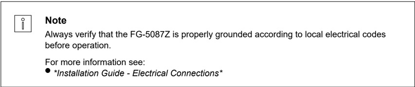
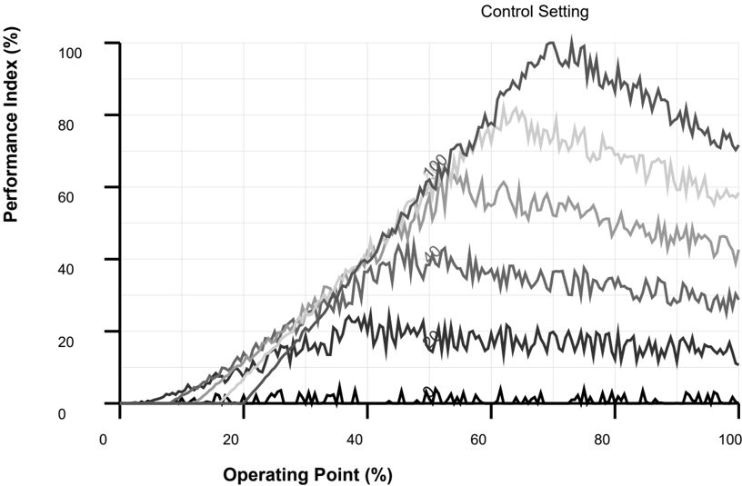
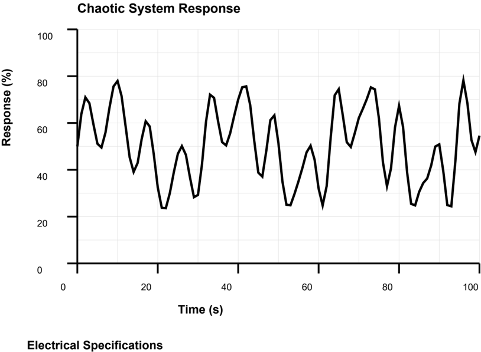
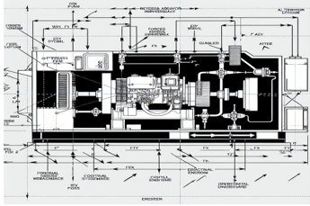
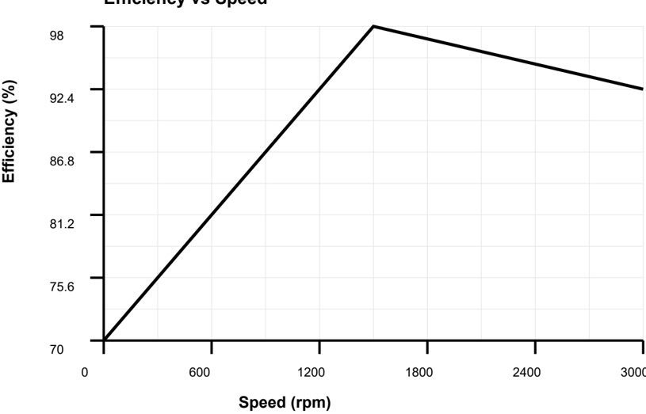
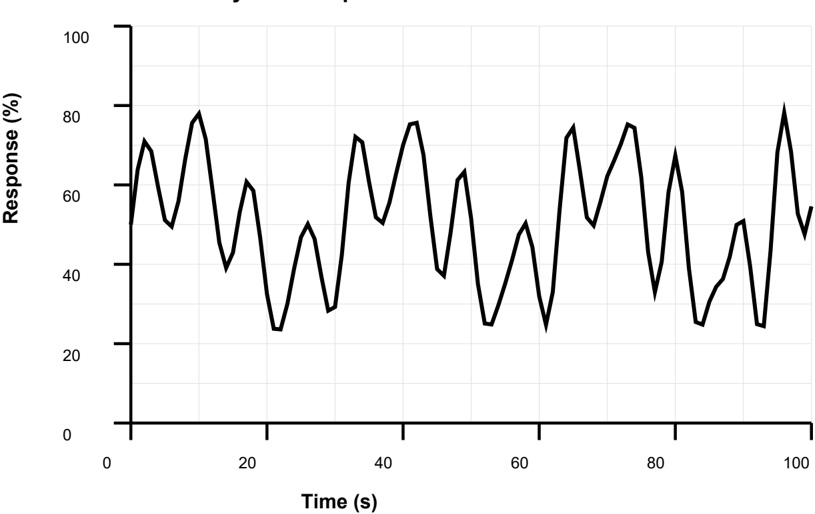
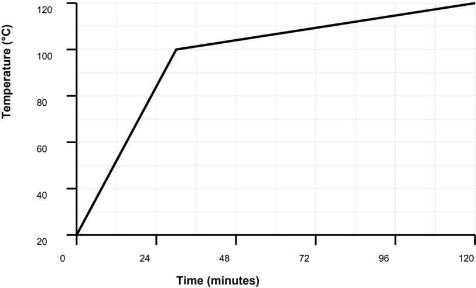
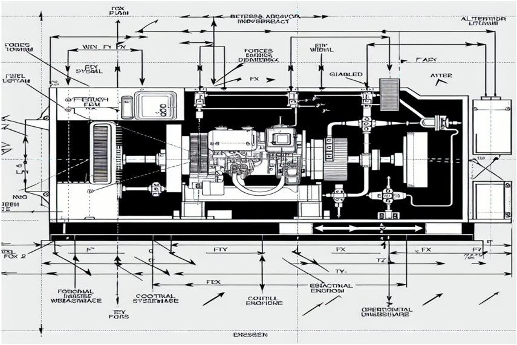
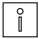

## Standby Generator

## Model: FG-5087Z

## OPERATION AND MAINTENANCE MANUAL

Version: 3.9 Date: November 2025

## TABLE OF CONTENTS

| Section                  |   Page |
|--------------------------|--------|
| Table Of Contents        |      2 |
| Introduction             |      3 |
| Safety Instructions      |      4 |
| Technical Specifications |      5 |
| Installation             |      6 |
| Operation                |      7 |
| Maintenance              |      8 |
| Troubleshooting          |      9 |
| Parts List               |     12 |
| Wiring Diagrams          |     15 |
| Standards                |     18 |
| Appendix                 |     20 |

This manual is organized into sections covering safety, technical specifications, installation, operation, maintenance, troubleshooting, and parts information. Each section should be reviewed before beginning work.

This equipment must be installed and operated in accordance with local codes, regulations, and industry standards. Consult with qualified personnel if you have questions about compliance requirements.

All personnel involved in installation, operation, or maintenance of this equipment must be properly trained and familiar with the contents of this manual.

The Generator is designed for industrial applications requiring reliable performance and long service life. Proper installation, operation, and maintenance are essential for achieving optimal results.

Before operating the FG-5087Z, ensure that all installation requirements have been met and that the equipment has been properly commissioned by qualified personnel.

This document contains detailed technical specifications, installation procedures, operational guidelines, and maintenance schedules to ensure optimal performance and safety.

For technical support or additional information, please contact your local distributor or visit our website.

| Warning   | Description                                                                                                | Elimination/Action                                                                               |
|-----------|------------------------------------------------------------------------------------------------------------|--------------------------------------------------------------------------------------------------|
|           | Allow equipment to cool before maintenance. Use appropriate protective equipment when handling components. | hot Wait for equipment to reach ambient temperature. Wear heat-resistant gloves.                 |
|           | Some lubricants and materials may cause allergic reactions in sensitive individuals.                       | Use protective gloves. Ensure adequate Consult material safety data sheets.                      |
|           | Pressure can build up during operation. Sudden release can cause injury.                                   | Release pressure slowly using appropriate procedures. Never remove caps or plugs under pressure. |
|           | Overfilling can cause leakage, overheating, and equipment damage.                                          | Follow manufacturer specifications for fill Check levels regularly.                              |
|           | Mixing incompatible oils can cause equipment and void warranty.                                            | failure Use only specified lubricants. Drain completely before changing oil type.                |
|           | Warming oil before use improves flow and ensures proper distribution.                                      | Heat oil to recommended temperature (typically 40-50°C) before application.                      |
|           | The amount of new lubricant should match the volume drained to maintain proper levels.                     | Measure drained volume accurately. Add equivalent amount of new lubricant.                       |

| Warning   | Description                                             | Elimination/Action                                                                                              |
|-----------|---------------------------------------------------------|-----------------------------------------------------------------------------------------------------------------|
|           | Residual oil can be slippery and cause falls. properly. | Dispose of Clean up spills immediately. Use appropriate absorbent materials. Follow local disposal regulations. |

Environmental conditions such as temperature, altitude, and humidity can affect equipment performance. Specifications are based on standard conditions unless otherwise specified.

Some specifications may be optional or configurable. Consult with technical support or your local distributor to determine available options for your specific requirements.

All specifications are subject to change without notice as improvements are made to the product. Always refer to the latest version of this manual for current specifications.

This section provides detailed technical specifications for the Generator model FG-5087Z. All specifications are based on standard operating conditions unless otherwise noted.

## General Specifications

| Parameter             | Value     | Unit   | Notes          |
|-----------------------|-----------|--------|----------------|
| Power Output          | 10        | kW     | As specified   |
| Voltage Output        | 400V      | V      | Standard       |
| Frequency             | 60        | Hz     | Optional       |
| Fuel Consumption      | 40        |        |                |
| Weight                | 3567      | kg     | Approximate    |
| Operating Temperature | -17 to 51 | °C     | Continuous     |
| Storage Temperature   | -20 to 65 | °C     |                |
| Humidity              | 19 to 87  | % RH   | Non-condensing |
| Protection Class      | IP66      |        | IEC 60529      |
| Noise Level           | 62        | dB(A)  | At 1m distance |
| Vibration             | £ 5       | mm/s   | RMS            |
| Service Factor        | 1.15      |        |                |

## Dimensions

| Dimension      | Value   | Unit   | Tolerance   |
|----------------|---------|--------|-------------|
| Length         | 1493    | mm     | ±2 mm       |
| Width          | 215     | mm     | ±2 mm       |
| Height         | 622     | mm     | ±2 mm       |
| Mounting Holes | M12     |        |             |

| Dimension      |   Value | Unit   | Tolerance   |
|----------------|---------|--------|-------------|
| Shaft Diameter |      34 | mm     | ±0.1 mm     |
| Base Height    |     184 | mm     | ±1 mm       |

## Performance Data

| Operating Condition   |   Minimum |   Nominal |   Maximum | Unit   |
|-----------------------|-----------|-----------|-----------|--------|
| Power Consumption     |        90 |       100 |       105 | %      |
| Efficiency            |        85 |        92 |        98 | %      |
| Load Factor           |        23 |        76 |       105 | %      |
| Speed                 |       742 |      1472 |      2954 | rpm    |
| Torque                |        11 |        71 |       169 | Nm     |

## Environmental Conditions

| Condition         | Operating Range   | Storage Range   | Unit   |
|-------------------|-------------------|-----------------|--------|
| Temperature       | -13 to 53         | -22 to 65       | °C     |
| Relative Humidity | 15 to 85          | 9 to 95         | %      |
| Altitude          | 0 to 1198         | 0 to 2698       | m      |
| Vibration         | £ 2               | £ 10            | mm/s   |

| Parameter        | Value   | Unit       | Standard   |
|------------------|---------|------------|------------|
| Supply Voltage   | 400V    | V AC       | IEC 60038  |
| Frequency        | 60 Hz   | Hz         | IEC 60034  |
| Current Rating   | 31      | A          |            |
| Power Factor     | 0.92    |            |            |
| Starting Current | 491     | % of rated |            |
| Insulation Class | F       |            | IEC 60085  |
| Protection       | IP66    |            | IEC 60529  |

Regular inspection of electrical connections and components is essential for safe and reliable operation. Include electrical inspection in your maintenance schedule.

When operating at non-standard conditions, consult with technical support to determine if derating or special considerations are required.

## 4.1 Installation Requirements

## Installation Procedures

| Action                                                                                                                                                                                                                                                                                                                | Note                                                                                                                 |
|-----------------------------------------------------------------------------------------------------------------------------------------------------------------------------------------------------------------------------------------------------------------------------------------------------------------------|----------------------------------------------------------------------------------------------------------------------|
| • Verify alignment before final assembly. • Check that all mounting surfaces are clean and from burrs. • Use proper alignment tools as specified in the installation guide.                                                                                                                                           | free Misalignment can cause premature wear and failure. Refer to alignment procedures in Section 4.                  |
| • Apply proper torque to all fasteners. • Use torque values specified in the technical sheet (39 Nm for main bolts). • Tighten in the correct sequence as shown in installation diagram.                                                                                                                              | data the Overtightening can damage components. Undertightening can cause loosening during operation.                 |
| • Lubricate the sealing with grease just before fitting. • (Not too early - there is a risk of dirt and foreign particles adhering to the sealing.) • Fill 2/3 of the space between the dust lip and main lip with grease. • If the sealing is without dust lip, just lubricate main lip with a thin layer of grease. | the the Ensure that no grease is applied to the marked surface. Use approved lubricants specified in the parts list. |

| Action                                                                                                                                                                                                           | Note                                                                                                                            |
|------------------------------------------------------------------------------------------------------------------------------------------------------------------------------------------------------------------|---------------------------------------------------------------------------------------------------------------------------------|
| • Inspect the shaft surface before mounting. • If scratches or damage are found, the shaft must replaced since it may result in future leakage. • Do not try to grind or polish the shaft surface of the defect. | be to get rid Ensure proper surface finish is maintained. Refer to technical specifications for surface roughness requirements. |

Auxiliary systems such as cooling, lubrication, and ventilation must be properly connected and verified before startup.

The Generator requires careful handling during transport and installation to prevent damage to critical components.

The installation site must meet all specified requirements for foundation, space, environmental conditions, and access for maintenance. Verify all requirements before proceeding.

Before beginning installation, review all safety instructions in Section 2 and ensure that all personnel involved are properly trained and qualified.

Some installation tasks may require specialized tools or equipment. Ensure all necessary tools are available before beginning.

Before installation, ensure the following requirements are met:

## Installation Checklist

| Requirement                                                  | Specification              | Status   |
|--------------------------------------------------------------|----------------------------|----------|
| Adequate space for installation and maintenance access       | As per installation manual | n        |
| Proper foundation or mounting surface                        | As per installation manual | n        |
| Correct electrical supply voltage and frequency              | As per installation manual | n        |
| Appropriate environmental conditions (temperature, humidity) | As per installation manual | n        |
| Compliance with local building and electrical codes          | As per installation manual | n        |

## Foundation Requirements

| Parameter            | Minimum           | Recommended       | Unit   |
|----------------------|-------------------|-------------------|--------|
| Foundation Thickness | 327               | 321               | mm     |
| Concrete Strength    | C22               | C27               |        |
| Reinforcement        | As per local code | As per local code |        |
| Anchor Bolt Size     | M20               | M20               |        |

| Parameter         |   Minimum |   Recommended | Unit   |
|-------------------|-----------|---------------|--------|
| Anchor Bolt Depth |       218 |           282 | mm     |

## 4.2 Installation Steps

## Installation Procedure

|   Step | Description                                                         | Duration   | Tools Required                             |
|--------|---------------------------------------------------------------------|------------|--------------------------------------------|
|      1 | Unpack the equipment and inspect for damage.                        | 15 min     | Torque wrench, Wrench set                  |
|      2 | Position the equipment according to layout drawings.                | 30 min     | Torque wrench, Level                       |
|      3 | Secure the equipment to the foundation using appropriate fasteners. | 30 min     | Torque wrench, Level                       |
|      4 | Connect electrical wiring according to wiring diagrams.             | 30 min     | Torque wrench, Level                       |
|      5 | Connect auxiliary systems (cooling, lubrication, etc.).             | 15 min     | Alignment tools, Torque wrench, Wrench set |
|      6 | Perform initial alignment and calibration.                          | 2 hours    | Torque wrench, Level, Alignment tools      |
|      7 | Verify all connections and safety systems.                          | 30 min     | Alignment tools, Torque wrench, Wrench set |
|      8 | Perform initial test run according to startup procedure.            | 2 hours    | Torque wrench, Alignment tools, Wrench set |

## Torque Specifications

| Component            | Bolt Size   |   Torque | Unit   |
|----------------------|-------------|----------|--------|
| Mounting Bolts       | M16         |       97 | Nm     |
| Shaft Coupling       | M8          |       41 | Nm     |
| Terminal Connections | M6          |       14 | Nm     |
| Cover Bolts          | M8          |       16 | Nm     |

Document all installation measurements, adjustments, and test results. This information is valuable for troubleshooting and future maintenance.

Verify that all required tools, equipment, and materials are available before beginning installation. Missing items can cause delays and safety hazards.

## 5.1 Operating Procedures

Before operating the equipment, ensure that all installation and commissioning procedures have been completed and that the equipment is in proper working condition.

During operation, be alert for unusual sounds, vibrations, or other signs of problems. Stop the equipment immediately if safety concerns arise.

Coordination with other equipment and systems may be required for optimal operation. Ensure proper communication and coordination procedures are in place.

Emergency procedures must be understood by all operators. Practice emergency shutdown procedures regularly to ensure quick response when needed.

Some operating modes may have specific requirements or limitations. Review operating mode specifications before changing modes.

Follow these procedures for safe and efficient operation:

## Operating Parameters

| Parameter        | Setting    | Range                   | Unit   |
|------------------|------------|-------------------------|--------|
| Startup Sequence | Automatic  | Manual/Automatic        |        |
| Operating Mode   | Continuous | Continuous/Intermittent |        |
| Control Method   | Manual     | Manual/Automatic/Remote |        |
| Monitoring       | Enabled    | Enabled/Disabled        |        |
| Speed Setpoint   | 1442       | 1160                    | rpm    |
| Load Limit       | 91         | 110                     | %      |

## Startup Sequence

|   Step | Action                | Duration   | Status Indicator   |
|--------|-----------------------|------------|--------------------|
|      1 | Power On              | Immediate  | Power LED          |
|      2 | System Initialization | 11         | Init LED           |
|      3 | Self-Test             | 16         | Test LED           |
|      4 | Ready State           | Continuous | Ready LED          |
|      5 | Start Command         | On Demand  | Run LED            |

## 5.2 Control Functions

## Control Functions

| Control    | Function                     | Location   | Type        |
|------------|------------------------------|------------|-------------|
| Start/Stop | Controls equipment operation | Panel A    | Push Button |

| Control        | Function                                       | Location       | Type            |
|----------------|------------------------------------------------|----------------|-----------------|
| Speed Control  | Adjusts operating speed within specified range | Panel B        | Selector Switch |
| Emergency Stop | Immediately stops all operations               | Panel C        | Emergency Stop  |
| Reset          | Clears fault conditions and system             | resets Panel D | Reset Button    |
| Mode Selection | Selects operating mode                         | Panel E        | Selector        |

## Status Indicators

| Indicator   | Color   | Meaning           | Action           |
|-------------|---------|-------------------|------------------|
| Power       | Green   | System powered    | Normal operation |
| Run         | Green   | Equipment running | Normal operation |
| Fault       | Red     | Fault detected    | Check fault code |
| Warning     | Yellow  | Warning condition | Review warning   |
| Maintenance | Yellow  | Maintenance due   | Schedule service |

## Operating Characteristics

## Efficiency vs Speed

## Chaotic System Response

When operating in automatic mode, verify that all control signals are functioning correctly and that the equipment responds appropriately to commands.

Monitor operating parameters continuously during operation. Significant deviations from normal values may indicate problems requiring attention.

Emergency stop functions must be tested regularly to ensure they are functioning properly. Never disable safety systems.

## 6.1 Maintenance Schedule

Follow the maintenance schedule strictly to prevent premature failures and ensure optimal performance. Maintenance intervals may need to be adjusted based on operating conditions.

Before performing any maintenance, ensure the equipment is safely shut down and all safety protocols are followed. Refer to Section 2 for safety instructions.

All maintenance work must be performed by qualified personnel familiar with the equipment and maintenance procedures. Improper maintenance may cause equipment damage or safety hazards.

Regular maintenance is essential for maintaining the performance, reliability, and service life of the Generator. This section provides maintenance schedules and procedures.

## Maintenance Schedule

| Maintenance Task   | Frequency        | Duration   | Personnel    |
|--------------------|------------------|------------|--------------|
| Visual Inspection  | Daily            | 5 min      | Operator     |
| Lubrication        | Every 424 hours  | 30 min     | Technician   |
| Filter Replacement | Every 827 hours  | 1 hour     | Technician   |
| Bearing Inspection | Every 1222 hours | 2 hours    | Engineer     |
| Complete Overhaul  | Every 9497 hours | 8 hours    | Service Team |
| Calibration Check  | Every 2590 hours | 1 hour     | Engineer     |

## Inspection Checklist

| Item       | Check              | Acceptance Criteria        | Frequency   |
|------------|--------------------|----------------------------|-------------|
| Bearings   | Visual/Temperature | No noise, temp < 70°C      | Weekly      |
| Seals      | Visual             | No leakage                 | Weekly      |
| Mounting   | Visual/Torque      | Bolts tight, no movement   | Monthly     |
| Electrical | Visual/Measurement | No damage, correct voltage | Monthly     |
| Cooling    | Visual/Temperature | Clean, adequate flow       | Weekly      |
| Vibration  | Measurement        | < 5 mm/s RMS               | Monthly     |

## 6.2 Maintenance Procedures

- Always shut down and lock out equipment before maintenance.
- Follow manufacturer's recommendations for lubricants and spare parts.
- Inspect all components for wear, damage, or contamination.
- Replace worn or damaged parts immediately.
- Keep maintenance records for warranty and service history.
- Use only approved replacement parts and materials.

## Component Maintenance Intervals

| Component   | Inspection Interval   | Replacement Interval   | Condition          |
|-------------|-----------------------|------------------------|--------------------|
| Bearings    | Every 1538 hours      | Every 11515 hours      | Based on condition |
| Seals       | Every 731 hours       | Every 3781 hours       | If leaking         |
| Filters     | Every 610 hours       | Every 1665 hours       | If dirty           |
| Belts       | Every 1975 hours      | Every 3407 hours       | If worn            |

Some maintenance tasks require specialized tools or training. Do not attempt maintenance beyond your qualification level. Contact qualified service personnel when needed.

## Note

Maintenance personnel must be properly trained and familiar with the equipment. Inexperienced personnel should work under supervision.

For more information see:

- *Safety Manual - Lockout/Tagout Procedures*

## Temperature Characteristics

## Temperature Rise vs Time

Before beginning troubleshooting procedures, ensure the equipment is safely shut down and all safety protocols are followed. Always refer to the safety instructions in Section 2 before performing any diagnostic work.

Many issues can be resolved through basic inspection and maintenance. However, some problems may indicate more serious conditions that require professional service. When in doubt, contact technical support.

Troubleshooting the Generator requires systematic diagnosis of symptoms and their underlying causes. This section provides guidance for identifying and resolving common operational issues.

## Common Issues and Solutions

| Symptom                                 | Possible Cause                                                  | Solution                                                                                  |
|-----------------------------------------|-----------------------------------------------------------------|-------------------------------------------------------------------------------------------|
| Fault Code G849: Engine fault           | Engine failure, sensor issue, or control fault                  | Check engine, test sensors, verify control                                                |
| Excessive noise at specific frequencies | Resonance, mechanical wear, or structural issue                 | Identify frequency, check for inspect mechanical components                               |
| Fault Code G755: Low voltage            | Engine speed low, AVR fault, or load issue                      | Check engine speed, test AVR, verify load                                                 |
| Premature component failure             | Incorrect operation, poor maintenance, or environmental factors | Review operating procedures, improve maintenance schedule, check environmental conditions |
| Motor overload trip                     | Excessive load, mechanical binding, or motor fault              | Check load conditions, inspect for binding, test motor windings                           |
| Irregular speed or torque output        | Control system calibration or feedback sensor issue             | Recalibrate control system, verify feedback sensors, check signal                         |
| Encoder feedback error                  | Encoder failure, cable issue, or mounting problem               | Check encoder connections, verify signal integrity, inspect mounting                      |
| Bearing temperature high                | Insufficient lubrication, bearing wear, misalignment            | or Check lubrication levels, inspect bearings, verify alignment                           |
| Excessive vibration                     | Imbalance, misalignment, or worn bearings                       | Perform balancing check, verify alignment, inspect bearings                               |
| Leakage of fluid or lubricant           | Damaged seals, gaskets, or overfilling                          | Inspect seals and gaskets, verify levels, replace damaged components                      |
| Unusual noise during operation          | Bearing wear, misalignment, or loose components                 | Inspect bearings for wear, check alignment, tighten all fasteners                         |

When troubleshooting, always start with the simplest possible causes before investigating more complex issues. Many problems can be resolved through basic inspection and cleaning.

## Note

Always verify that the equipment is properly powered and all safety systems are functioning before attempting troubleshooting procedures.

For more information see:

*Technical Support - Contact Information*

## Spare Parts List

| Part Number   | Description      |   Quantity | Material        | Supplier Part No.   |
|---------------|------------------|------------|-----------------|---------------------|
| FG-5087Z-183  | Main Housing     |          4 | Stainless Steel | SP-73442            |
| FG-5087Z-302  | Rotor Assembly   |          3 | Cast Iron       | SP-77954            |
| FG-5087Z-476  | Stator Assembly  |          3 | Steel           | SP-94676            |
| FG-5087Z-600  | Bearing Set      |          3 | Cast Iron       | SP-72940            |
| FG-5087Z-205  | Shaft            |          3 | Aluminum        | SP-23907            |
| FG-5087Z-259  | Seal Kit         |          1 | Bronze          | SP-98957            |
| FG-5087Z-114  | Gasket Set       |          1 | Plastic         | SP-64797            |
| FG-5087Z-807  | Mounting Bracket |          3 | Cast Iron       | SP-14596            |
| FG-5087Z-937  | Cooling Fan      |          3 | Stainless Steel | SP-66174            |
| FG-5087Z-234  | Terminal Box     |          1 | Steel           | SP-55661            |

| Part Number   | Description        |   Quantity | Material        | Supplier Part No.   |
|---------------|--------------------|------------|-----------------|---------------------|
| FG-5087Z-761  | Nameplate          |          1 | Aluminum        | SP-27476            |
| FG-5087Z-179  | Fastener Kit       |          2 | Plastic         | SP-44520            |
| FG-5087Z-630  | Thermal Protection |          4 | Steel           | SP-14542            |
| FG-5087Z-672  | Vibration Sensor   |          1 | Plastic         | SP-56576            |
| FG-5087Z-295  | Oil Filter         |          1 | Stainless Steel | SP-74231            |
| FG-5087Z-136  | Cooling Coil       |          3 | Steel           | SP-75132            |
| FG-5087Z-773  | Impeller           |          3 | Cast Iron       | SP-40689            |

## Recommended Spare Parts

| Part Number   | Description    | Recommended Stock   | Lead Time   |
|---------------|----------------|---------------------|-------------|
| FG-5087Z-492  | Bearing Set    | 1-2                 | 2-4 weeks   |
| FG-5087Z-908  | Seal Kit       | 1-2                 | 2-4 weeks   |
| FG-5087Z-130  | Gasket Set     | 2-3                 | 2-4 weeks   |
| FG-5087Z-466  | Filter Element | 3-5                 | 2-4 weeks   |
| FG-5087Z-936  | Thermal Fuse   | 3-5                 | 4-6 weeks   |

## Lubrication Requirements

| Component     | Lubricant Type   |   Quantity | Interval         |
|---------------|------------------|------------|------------------|
| Main Bearings | Oil ISO VG 68    |         75 | Every 1883 hours |
| Gearbox       | Oil ISO VG 220   |          3 | Every 3522 hours |
| Seals         | Silicone Grease  |         17 | Every 832 hours  |

Refer to the wiring diagrams provided in the appendix. All connections must be made according to local electrical codes and regulations.

## Terminal Connections

| Terminal   | Function         | Wire Size   | Voltage   |
|------------|------------------|-------------|-----------|
| L1, L2, L3 | Power Input      | 4 mm²       | 400V      |
| PE         | Protective Earth | 2.5 mm²     | 0V        |
| U, V, W    | Motor Output     | 6 mm²       | Variable  |
| 24V        | Control Supply   | 0.75 mm²    | 24V DC    |
| GND        | Control Ground   | 0.75 mm²    | 0V        |

The Generator is compliant with applicable international standards for industrial machinery and electrical equipment. In case of deviation from these standards, these are listed in the declaration of incorporation. The declaration of incorporation is part of the delivery.

## Machine Standards

| Standard    | Description                                                                          |
|-------------|--------------------------------------------------------------------------------------|
| ISO 12100   | Safety of machinery - General principles for design - Risk assessment risk reduction |
| IEC 60204-1 | Safety of machinery - Electrical equipment of machines - Part 1: requirements        |

## Other Standards Used in Design

| Standard         | Description                                                                                                     |
|------------------|-----------------------------------------------------------------------------------------------------------------|
| IEC 61000-6-2    | Electromagnetic compatibility (EMC) - Part 6-2: Generic standards Immunity standard for industrial environments |
| IEC 61000-6-4    | Electromagnetic compatibility (EMC) - Part 6-4: Generic standards Emission standard for industrial environments |
| ISO 13849-1:2015 | Safety of machinery - Safety related parts of control systems - Part General principles for design              |

## A. Technical Data Sheets

Additional technical data sheets and detailed specifications are available upon request.

## Revision History

## Revision History

| Revision   | Description                                                                                                                                                                                                                                                                                                           |
|------------|-----------------------------------------------------------------------------------------------------------------------------------------------------------------------------------------------------------------------------------------------------------------------------------------------------------------------|
| V          | • Published in release R17.2. The following updates are made in this revision: • Clarified and added information in mounting instructions for rotating sealings. • Added information about optimization and calibration procedures in calibration • Replaced article number and name of grease, previously 3793289-2. |
| Z          | • Published in release R21B. The following updates are made in this revision: • Clarified and added information in mounting instructions for rotating sealings. • Added information about optimization and calibration procedures in calibration • Replaced article number and name of grease, previously 3793289-2.  |

| Revision   | Description                                                                                                                                                                                                                                                              |
|------------|--------------------------------------------------------------------------------------------------------------------------------------------------------------------------------------------------------------------------------------------------------------------------|
| N          | • Published in release R24A. The following updates are made in this revision: • Updated information about special treated screws. • Removed information about position switches as they are no longer available. • Updated torque specifications for various components. |
| U          | • Published in release R23A. The following updates are made in this revision: • Added sections in general procedures. • Safety restructured. • Updated spare part number brake release board (was DSQC555, is DSQC1010). • Information about business portal added.      |
| Y          | • Published in release R20B. The following updates are made in this revision: • New tool for replacement of parallel bar. • Updated maintenance procedures. • Added calibration requirements.                                                                            |
| T          | • Published in release R19B. The following updates are made in this revision: • Added sections in general procedures. • Safety restructured. • Updated spare part number brake release board (was DSQC555, is DSQC1010). • Information about business portal added.      |
| W          | • Published in release R24D. The following updates are made in this revision: • New tool for replacement of parallel bar. • Updated maintenance procedures. • Added calibration requirements.                                                                            |

## B. Contact Information

## Contact Information

| Department        | Contact            |
|-------------------|--------------------|
| Technical Support | support@forgis.com |
| Sales             | sales@forgis.com   |
| Service           | service@forgis.com |
| Emergency         | +1-800-XXX-XXXX    |